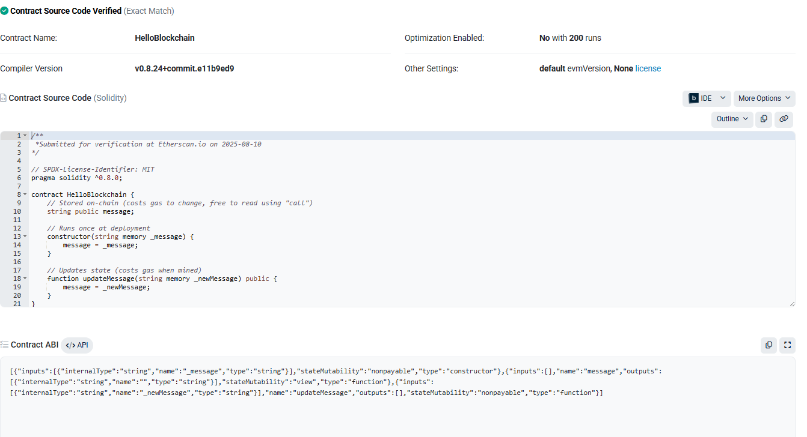
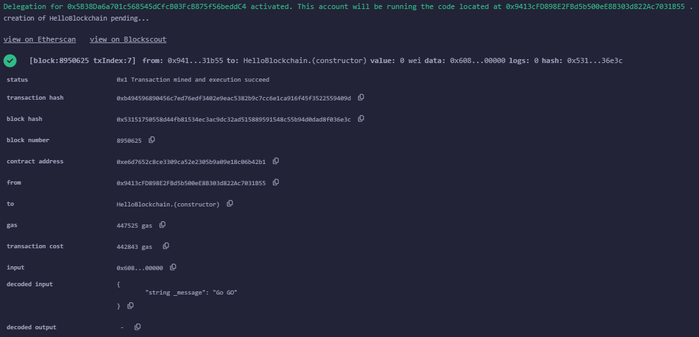

# Hello Blockchain (Solidity)

Minimal contract to store and update a message.

## Deployed (Sepolia)
- **Contract:** <0xE6d7652c8cE3309cA52e2305B9A09e18c06b42B1>
- **Creation Tx:** <[block:8950625 txIndex:7]from: 0x941...31b55to: HelloBlockchain.(constructor)value: 0 weidata: 0x608...00000logs: 0hash: 0x531...36e3c
creation of SimplePaymentSplitter errored: Error encoding arguments: TypeError: expected array value (argument="", value="", code=INVALID_ARGUMENT, version=6.14.0)>
- **Verified on Etherscan:** <Yes>

## Try it in Remix
1) Compile (0.8.x) and deploy with an initial message.
2) Read with `message()` (free call).
3) Update with `updateMessage("...")` (transaction).

## Screenshots
Add images in `/assets`:
- Deployed view
- Tx receipt  
*(Drag your PNGs here: `/assets/deployed.png`, `/assets/tx.png`)*

## Notes
Demo contract; no access control. For production add an owner or role.

printf "node_modules/\n.env\nartifacts/\ncache/\n" > .gitignore

printf "MIT License\n\nCopyright (c) %s <Shahrukhali>\n" "$(date +%Y)" > LICENSE

# Hello Blockchain (Solidity)

Minimal contract to store and update a message.

## Deployed (Sepolia)
- **Contract:** `0xE6d7652c8cE3309cA52e2305B9A09e18c06b42B1`
- **Contract on Etherscan:** https://sepolia.etherscan.io/address/0xE6d7652c8cE3309cA52e2305B9A09e18c06b42B1
- **Creation Tx:** https://sepolia.etherscan.io/tx/<0x9a943b7e208d17075577a013f33edf6112fb0dc93698c4eaf7f5f3c81772ef94>
- **Verified on Etherscan:** <Yes>

## Try it in Remix
1) Compile (0.8.x) and deploy with an initial message.
2) Read with `message()` (free call).
3) Update with `updateMessage("...")` (transaction).

## Screenshots

## Notes
Demo contract; no access control. For production add an owner or role.
